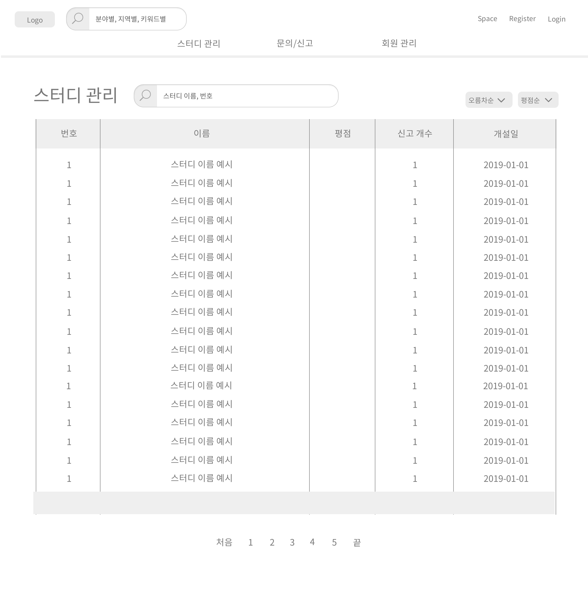

# UC-관리자 스터디 관리

- 생성되어있는 스터디를 조회, 검색, 삭제하는 유스케이스이다.

## 주 액터(Primary Actor)

관리자

## 보조 액터(Secondary Actor)

## 사전 조건(Preconditions)

- 관리자로 로그인되어있어야 한다.

## 종료 조건(Postconditions)

- 스터디를 조회하였다.
- 스터디를 검색하였다.
- 스터디를 삭제하였다.

## 시나리오(Flow of Events)

### 스터디 조회하기

1. 액터는 관리자 페이지에서 스터디 메뉴를 클릭한다.

2. 시스템은 스터디 목록(번호, 이름, 개설일)을 번호 내림차순으로 출력한다.

        
3. 액터는 목록에서 스터디 이름을 클릭한다.

4. 시스템은 해당 스터디 게시판 관리의 '게시글 조회하기' 유스케이스 2번으로 간다.

    - 스터디가 존재하지 않는다면,
        - 시스템은 스터디가 존재하지 않는다는 내용을 출력한다.
        
### 스터디 검색하기

1. 액터는 관리자 페이지에서 스터디 메뉴를 클릭한다.

2. 시스템은 스터디 목록(번호, 이름, 개설일)을 번호 내림차순으로 출력한다.
        
3. 액터는 검색 항목에 스터디의 이름 혹은 번호를 입력하고 검색 버튼을 누른다.

4. 시스템은 해당 이름 혹은 번호의 스터디를 목록에 출력한다.

    - 해당 이름 혹은 번호의 스터디가 존재하지 않는다면,
        - 시스템은 해당 이름 혹은 번호의 스터디가 존재하지 않는다는 내용을 출력한다.
        
5. 액터는 목록에서 스터디 이름을 클릭한다.

6. 시스템은 해당 스터디 게시판 관리의 '게시글 조회하기' 유스케이스 2번으로 간다.

### 스터디 삭제하기

1. 액터는 스터디 목록에서 해당 스터디 삭제 버튼을 누른다.
2. 시스템은 '스터디 삭제 여부 창'을 띄우고, 액터는 삭제 버튼을 다시 한번 누른다.
3. 시스템은 해당 스터디를 삭제한 후 '스터디 조회하기' 유스케이스의 2번으로 간다.
    - 해당 스터디가 없으면,
        - 시스템은 스터디가 없음을 알린다.

## UI 프로토타입

