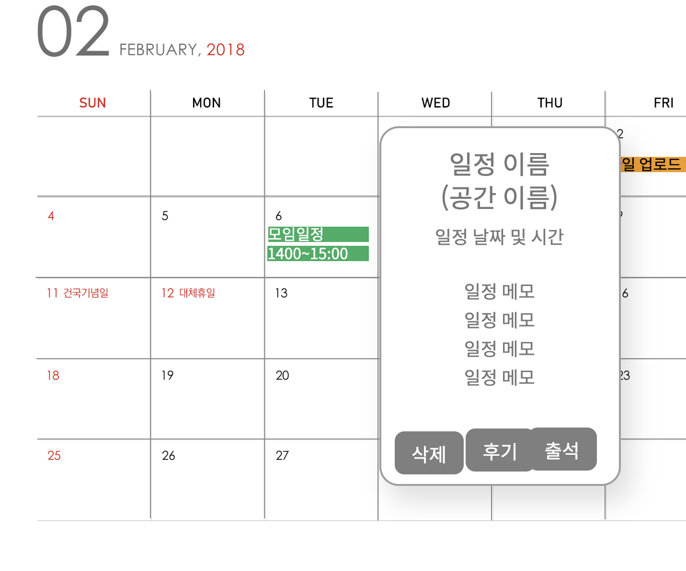

# - 스터디공간 후기관리
스터디공간에 대한 후기를 등록, 변경, 삭제하는 유즈케이스이다.

## 주 액터(Primary Actor)

스터디장

## 보조 액터(Secondary Actor)

## 사전 조건(Preconditions)

해당 스터디의 스터디장이다.

## 종료 조건(Postconditions)

- 스터디공간 후기를 등록하였다.
- 스터디공간 후기를 변경하였다.
- 스터디공간 후기를 삭제하였다.

## 시나리오(Flow of Events)

### 스터디공간후기 등록하기-공간 상세정보에서 등록하는 경우

1. 액터는 스터디공간 상세 조회에서 후기 등록 버튼을 누른다.
    - 스터디 장이 아니라면 후기의 등록 버튼이 비활성화 되어있다. 
    - 해당 스터디공간에서 일정 예약 후 진행한 적이 한번도 없다면, 시스템은 스터디공간 일정 예약 기록이 없다는 내용을 출력한다.
2. 시스템은 스터디공간 후기 등록 폼을 출력한다.
3. 액터는 별점과 후기를 입력한 뒤 등록 버튼을 누른다.
    - 별점이 입력되지 않거나, 후기가 최소 30자가 안된다면, 시스템은 해당 항목을 기입해달라는 내용을 출력한다.
4. 시스템은 스터디공간 후기 정보를 저장한 뒤, [스터디공간조회](../sangmin/uc-스터디공간조회.md) 유스케이스의 4번으로 간다.

### 스터디공간후기 등록하기-일정에서 등록하는 경우

1. 액터는 [스터디일정](uc-스터디일정.md)에서 해당 일정에 마우스를 올린다.
2. 시스템은 스터디공간 예약 정보(날짜 및 시간, 공간정보)와 삭제 버튼, 후기 버튼, 출석 버튼을 탭으로 출력한다.
    - 스터디장이 아니거나, 아직 예약된 날짜 및 시간이 지나지 않았다면 출석 버튼과 후기 버튼은 비활성화 되어있다.
3. 액터는 후기 버튼을 누른다.
4. 시스템은 스터디공간 후기 등록 폼을 출력한다.
5. 액터는 별점과 후기를 입력한 뒤 등록 버튼을 누른다.
    - 별점이 입력되지 않거나, 후기가 최소 30자가 안된다면, 시스템은 해당 항목을 기입해달라는 내용을 출력한다.
6. 시스템은 스터디공간 후기 정보를 저장한 뒤, [스터디공간조회](../sangmin/uc-스터디공간조회.md) 유스케이스의 4번으로 간다.

### 스터디공간후기 변경하기

1. 액터는 스터디공간 상세 조회에서 자신이 작성한 후기의 수정 버튼을 누른다.
    - 자신이 작성한 후기가 아니라면 수정 버튼이 비활성화 되어있다. 
2. 시스템은 기존 내용이 입력되어있는 스터디공간 후기 등록 폼을 출력한다.
3. 액터는 별점과 후기를 수정한 뒤 등록 버튼을 누른다.
    - 별점이 입력되지 않거나, 후기가 최소 30자가 안된다면, 시스템은 해당 항목을 기입해달라는 내용을 출력한다.
4. 시스템은 스터디공간 후기 정보를 저장한 뒤, [스터디공간조회](../sangmin/uc-스터디공간조회.md) 유스케이스의 4번으로 간다.

### 스터디공간후기 삭제하기

1. 액터는 스터디공간 상세 조회에서 자신이 작성한 후기의 삭제 버튼을 누른다.
    - 자신이 작성한 후기가 아니라면 삭제 버튼이 비활성화 되어있다. 
2. 시스템은 삭제 여부를 다시 한번 묻는 메시지를 출력한다.
3. 액터는 확인 버튼을 누른다.
4. 시스템은 스터디공간 후기 정보를 삭제한 뒤, [스터디공간조회](../sangmin/uc-스터디공간조회.md) 유스케이스의 4번으로 간다.

## UI 프로토타입

### 스터디룸 조회 목록

 

