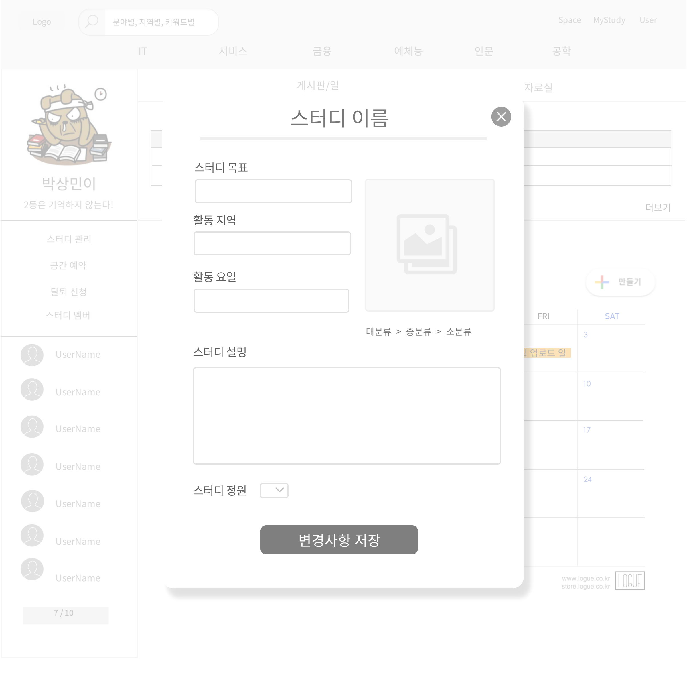

# UC- 스터디관리
스터디장이 스터디 정보를 변경하는 유스케이스

## 주 액터(Primary Actor)
스터디장

## 보조 액터(Secondary Actor)
## 사전 조건(Preconditions)

- 해당 스터디의 스터디장으로 로그인되어있어야 한다.

## 종료 조건(Postconditions)
- 변경된 스터디 정보가 시스템에 등록되었다.

## 시나리오(Flow of Events)

### 기본 흐름(Basic Flows)

- 1. 액터가 스터디 관리 버튼을 클릭할 때 이 유스케이스를 시작한다.
- 2. 시스템은 스터디 관리 폼(스터디 이름, 목표, 스터디 시작일, 활동 지역, 활동 요일, 설명, 정원, 모집상태, 사진, 분류)을 출력한다.
- 3. 액터는 스터디 목표, 활동 지역, 활동 요일, 설명, 정원, 모집상태, 사진 항목에 변경 내용을 입력하고 변경 사항 저장 버튼을 누른다.
- 4. 시스템은 해당 스터디 정보를 변경한 후 '스터디 게시판/일정 조회' 유스케이스로 간다.

### 예외 흐름(Exception Flows)

- 4.1 스터디 설명과 목표 항목의 내용이 최대 글자수를 초과하면,
    - 시스템은 입력 항목의 최대 글자수 아래로 작성해달라는 내용을 출력한다.
    
    
## UI 프로토타입

