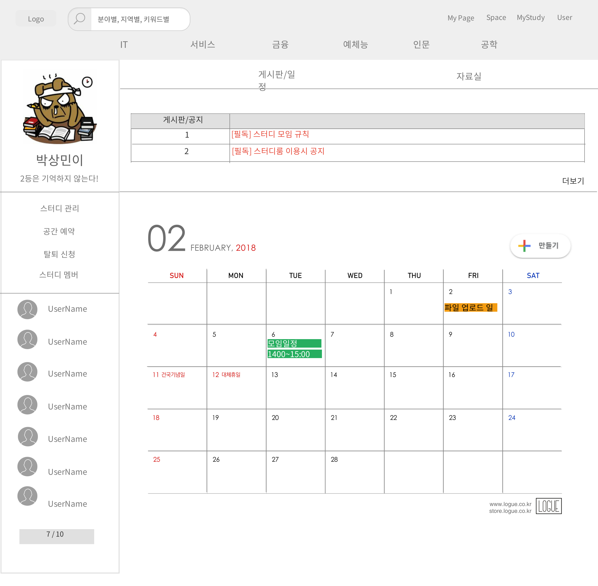
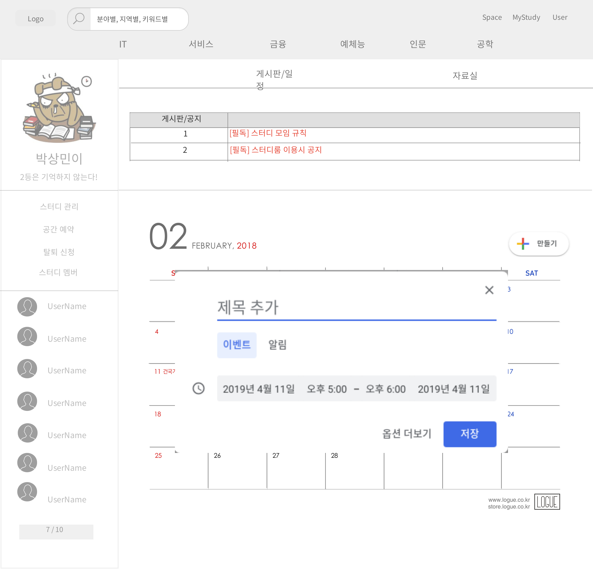

# UC- 스터디 일정 관리

스터디 일정을 등록, 조회, 수정, 삭제하는 유스케이스이다.

## 주 액터(Primary Actor)

스터디장, 스터디원

## 보조 액터(Secondary Actor)

## 사전 조건(Preconditions)

- 스터디장 또는 스터디원으로 로그인되있어야 한다.

## 종료 조건(Postconditions)

- 스터디 일정을 등록하였다.
- 스터디 일정을 조회하였다.
- 스터디 일정을 변경하였다.
- 스터디 일정을 삭제하였다.

## 시나리오(Flow of Events)

### 스터디 일정 조회하기

1. 액터는 마이스터디 페이지에서 스터디 일정/게시판 탭을 클릭한다.
2. 시스템은 일정 캘린더의 해당 일정 날짜에 일정 이름과 시간을 출력한다.
3. 액터는 캘린더에서 스터디 일정 이름에 마우스를 올린다.
4. 시스템은 스터디 일정 상세 정보(일정 이름, 날짜 및 시간, 메모)과 변경버튼, 삭제버튼을 탭으로 출력한다.
    - 스터디 일정이 공간 예약 일정이라면, 스터디공간 예약 정보(공간 이름,날짜 및 시간, 공간정보(메모에 들어감))와 출석 버튼, 후기버튼, 삭제버튼을 탭으로 출력한다.
        - 스터디장이 아니거나, 아직 예약된 날짜 및 시간이 지나지 않았다면 출석버튼, 후기버튼은 비활성화 되어있다.

### 스터디 일정 등록하기 

1. 액터는 스터디 일정 등록 버튼을 클릭한다.
2. 시스템은 스터디 일정 등록 폼을 출력한다.
3. 액터는 스터디 일정 정보(이름, 날짜 및 시간, 메모)를 입력하고 등록 버튼을 누른다.
4. 시스템은 스터디 일정 정보를 저장한 후 '스터디 일정 조회하기' 유스케이스의 2번으로 간다.
    - 필수 입력 항목(이름, 날짜 및 시간)이 비어 있다면,
        - 시스템은 필수 입력 항목이 비어 있음을 알린다.
    - 날짜 및 시간이 중복되었다면,
        - 시스템은 날짜 및 시간이 중복되었음을 알린다.

### 자신이 작성한 스터디 일정 변경하기

1. 액터는 탭으로 출력된 스터디 일정 상세 정보에서 변경버튼을 클릭한다.
    - 해당 일정이 공간일정일 경우, 변경 버튼은 활성화되지않는다.
2. 시스템은 스터디 일정 변경 폼을 출력한다.
3. 액터는 스터디 일정 정보(이름, 날짜 및 시간, 메모)를 입력하고 변경 버튼을 누른다.
4. 시스템은 일정 캘린더에 스터디 일정 정보를 변경한 후 '스터디 일정 조회하기' 유스케이스의 4번으로 간다.
    - 필수 입력 항목(이름, 날짜 및 시간)이 비어 있다면,
        - 시스템은 필수 입력 항목이 비어 있음을 알린다.
    - 날짜 및 시간이 중복되었다면,
        - 시스템은 날짜 및 시간이 중복되었음을 알린다.

### 자신이 작성한 스터디 일정 삭제하기

1. 액터는 탭으로 출력된 스터디 일정 상세 정보에서 삭제버튼을 클릭한다.
2. 시스템은 '일정 취소 여부' 창을 출력하고, 액터는 다시 한번 취소 버튼을 누른다.
3. 시스템은 일정 캘린더에서 해당 일정을 삭제한 후 '스터디 일정 조회하기' 유스케이스의 2번으로 간다.
    - 해당 일정이 없으면,
        - 시스템은 일정이 없음을 알린다.
        

### 스터디 일정 변경하기(스터디장)

1. 스터디장은 탭으로 출력된 스터디 일정 상세 정보에서 변경버튼을 클릭한다.
2. 시스템은 스터디 일정 변경 폼을 출력한다.
3. 스터디장은 스터디 일정 정보(이름, 날짜 및 시간, 메모)를 입력하고 변경 버튼을 누른다.
4. 시스템은 스터디 일정 정보를 변경한 후 '스터디 일정 조회하기' 유스케이스의 4번으로 간다.
    - 필수 입력 항목(이름, 날짜 및 시간)이 비어 있다면,
        - 시스템은 필수 입력 항목이 비어 있음을 알린다.
    - 날짜 및 시간이 중복되었다면,
        - 시스템은 날짜 및 시간이 중복되었음을 알린다.

### 스터디 일정 삭제하기(스터디장)

1. 스터디장은 탭으로 출력된 스터디 일정 상세 정보에서 삭제버튼을 클릭한다.
2. 시스템은 '일정 삭제 여부' 창을 출력하고, 스터디장은 다시 한번 삭제 버튼을 누른다.
3. 시스템은 해당 일정을 삭제한 후 '스터디 일정 조회하기' 유스케이스의 2번으로 간다.
    - 해당 일정이 없으면,
        - 시스템은 일정이 없음을 알린다.

## UI 프로토타입

