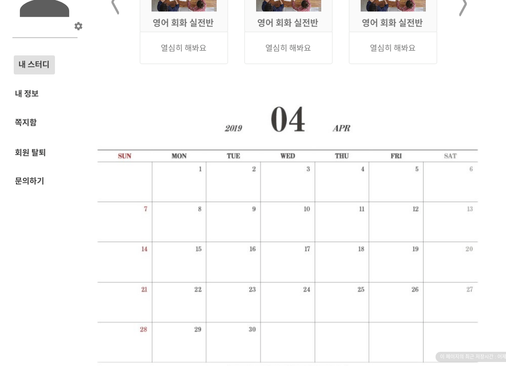

# 일정 조회

나의 통합 일정을 조회하는 유스케이스이다.

## 주 액터(Primary Actor)

회원

## 보조 액터(Secondary Actor)

## 사전 조건(Preconditions)

- 회원으로 로그인 되어있는 상태이다.

## 종료 조건(Postconditions)

- 마이페이지의 일정 조회가 출력되었다.

## 시나리오(Flow of Evnets)

1. 액터가 MyPage 버튼을 클릭하면 시스템은 MyPage 화면 하단에 통합 일정을 출력한다.

- 1.1 액터가 일정을 클릭하면 시스템은 스터디 상세화면을 출력한다.

## 일정조회 화면

