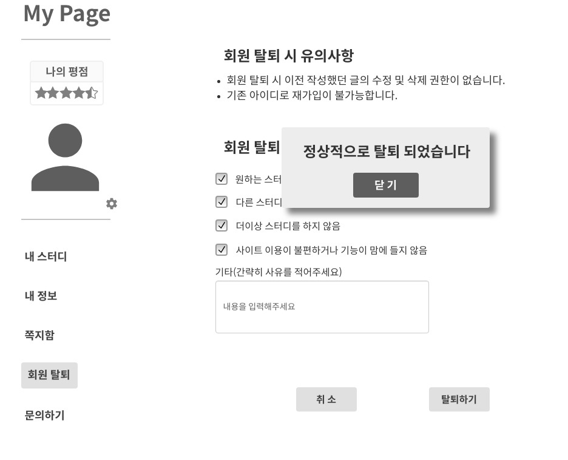

# 회원 탈퇴

- 회원 탈퇴 기능을 하는 유스케이스이다.

## 주 액터(Primary Actor)

- 회원

## 보조 액터(Secondary Actor)

## 사전 조건(Preconditions)

- 회원으로 로그인 되어있는 상태이다.

## 종료 조건(Postconditions)

- 회원 탈퇴를 완료했다.

## 시나리오(Flow of Evnets)

### 기본흐름
1. 액터가 MyPage 버튼을 클릭하면,
시스템은 MyPage 화면을 출력한다.
2. 액터가 회원탈퇴 버튼을 클릭하면,
시스템은 비밀번호 재확인 화면을 출력한다.
3. 액터가 비밀번호를 올바르게 입력하고 확인 버튼을 클릭하면,
탈퇴 사유 입력 화면을 출력한다.
4. 액터가 탈퇴 사유를 입력하고 탈퇴하기 버튼을 클릭하면,
'정상적으로 탈퇴되었습니다' 폼을 출력한다.
5. 액터가 닫기 버튼을 클릭하면,
시스템은 메인화면을 출력한다.

### 예외흐름
- 3.1. 액터가 비밀번호 재확인 화면에서 비밀번호를 잘못 입력하면,
'비밀번호가 틀렸습니다' 화면을 출력한다.
- 3.2. 액터가 닫기 버튼을 클릭하면,
시스템은 비밀번호 재확인 화면을 다시 출력한다.

## 회원 탈퇴 화면

