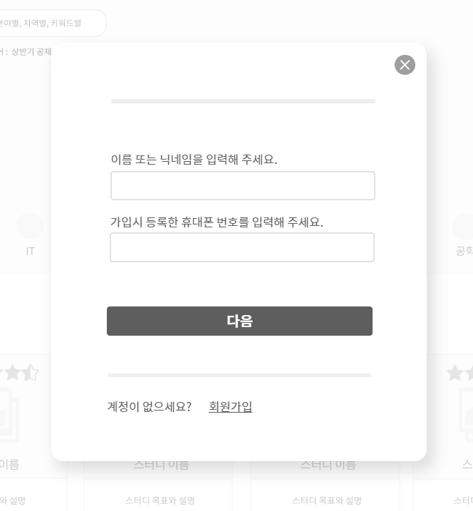
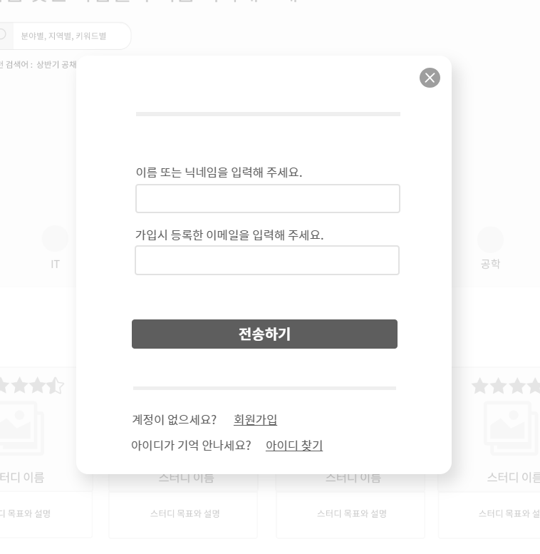

#UC - 아이디, 비밀번호 찾기
- 회원이 가입시 입력한 아이디, 비밀번호를 찾기 위한 유스케이스 이다.

## 주 액터(Primary Actor)
회원

## 보조 액터(Secondary Actor)

## 사전 조건(Preconditions)
- 엑터는 로그인 버튼을 누른다.
- 시스템은 로그인 폼을 출력한다.

## 종료 조건(Postconditions)
- 아이디를 찾았다.
- 비밀번호를 찾았다.

## 시나리오(Flow of Evnets)

### 기본 흐름(Basic Flows)
- 1. 엑터가 로그인 버튼을 클릭할 때 이 유스케이스를 시작한다.
- 2. 시스템은 로그인 폼을 출력한다.
- 3. 액터는 이메일, 암호를 입력한 후 로그인 버튼을 클릭한다.
- 4. 로그인에 성공하여 이 전 페이지의 유스케이스로 간다.

### 아이디 찾기
- 1. 엑터가 아이디 찾기를 클릭할 때 이 유스케이스를 시작한다.
- 2. 시스템은 아이디 찾기 폼을 출력한다.
- 3. 엑터는 이름 혹은 닉네임과 회원가입시 등록한 휴대폰 번호를 입력한다.
- 4. 해당 정보가 있다면 시스템은 회원가입시 등록한 이메일을 알려준다.
- 5. 엑터는 시스템이 출력한 내용을 확인 후 확인버튼을 누른다.
- 6. 시스템은 로그인 폼을 출력한다.

### 비밀번호 찾기
- 1. 엑터가 비밀번호 찾기를 클릭할 때 이 유스케이스를 시작한다.
- 2. 시스템은 비밀번호 찾기 폼을 출력한다.
- 3. 엑터는 이름 혹은 닉네임과 회원가입시 등록한 이메일을 입력한다.
- 4. 시스템은 이름 혹은 닉네임과 회원가입시 등록한 이메일이 일치한다면, 해당 이메일로 임시 비밀번호를 전송한다.
- 5. 이메일을 전송 후 시스템은 로그인 폼을 출력한다.

### 아이디 찾기 예외 흐름
- 엑터가 입력한 이름 혹은 닉네임과 회원가입시 등록한 휴대폰 번호가 없다면, 시스템은 정보를 재입력 하라고 알린다.

### 비밀번호 찾기 예외 흐름
- 엑터가 입력한 이름 혹은 닉네임과 회원가입시 등록한 이메일이 일치하지 않는다면, 시스템은 정보를 재입력 하라고 알린다.

### 아이디 찾기

### 비밀번호 찾기
