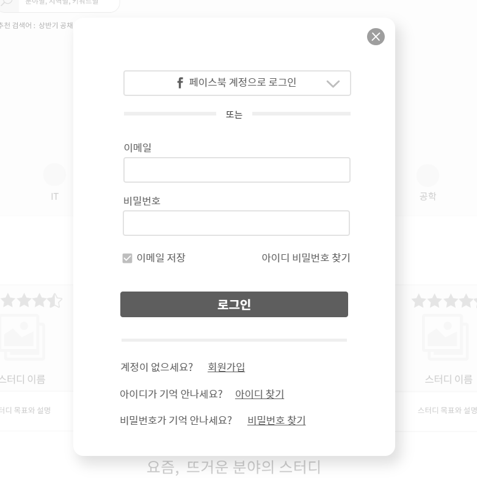

#UC - 로그인 하기(Login)
- 회원이 스터디 가입, 스터디 관리, 공간 예약 등을 하기 위해 로그인 하는 유스케이스
- 관리자가 회원, 게시판을 관리하기 위해 로그인 하는 유스케이스

## 주 액터(Primary Actor)
회원

## 보조 액터(Secondary Actor)
페이스북
카카오톡
네이버

## 사전 조건(Preconditions)
- 회원 가입을 한 상태이다.

## 종료 조건(Postconditions)
- 회원가입시 입력한 암호와 같지 않다.
- 로그인 하였다.

## 시나리오(Flow of Evnets)

### 기본 흐름(Basic Flows)
- 1. 엑터가 로그인 버튼을 클릭할 때 이 유스케이스를 시작한다.
- 2. 시스템은 로그인 폼을 출력한다.
- 3. 액터는 이메일, 암호를 입력한 후 로그인 버튼을 클릭한다.
- 4. 로그인에 성공하여 이 전 페이지의 유스케이스로 간다.

### 대안 흐름(Alternative Flows)
- 1.1 엑터가 페이스북 로그인 버튼을 클릭할 때 이 유스케이스를 시작한다.
- 1.2 시스템은 페이스북 로그인 폼을 출력한다.
- 1.3 액터는 이메일, 암호를 입력한 후 로그인 버튼을 클릭한다.
- 1.4 로그인에 성공하여 이 전 페이지의 유스케이스로 간다.

- 2.1 엑터가 카카오톡 로그인 버튼을 클릭할 때 이 유스케이스를 시작한다.
- 2.2 시스템은 페이스북 로그인 폼을 출력한다.
- 2.3 액터는 이메일, 암호를 입력한 후 로그인 버튼을 클릭한다.
- 2.4 로그인에 성공하여 이 전 페이지의 유스케이스로 간다.

- 3.1 엑터가 네이버 로그인 버튼을 클릭할 때 이 유스케이스를 시작한다.
- 3.2 시스템은 페이스북 로그인 폼을 출력한다.
- 3.3 액터는 이메일, 암호를 입력한 후 로그인 버튼을 클릭한다.
- 3.4 로그인에 성공하여 이 전 페이지의 유스케이스로 간다.

### 예외 흐름(Exception Flows)
- 4.1 입력한 이메일, 암호 중에 한 개라도 값이 비어있거나, 입력한 값이 회원가입시 저장한 값과 다르다면, 이메일 혹은 비밀번호를 확인하라는 내용을 출력한다.

### 로그인 폼
