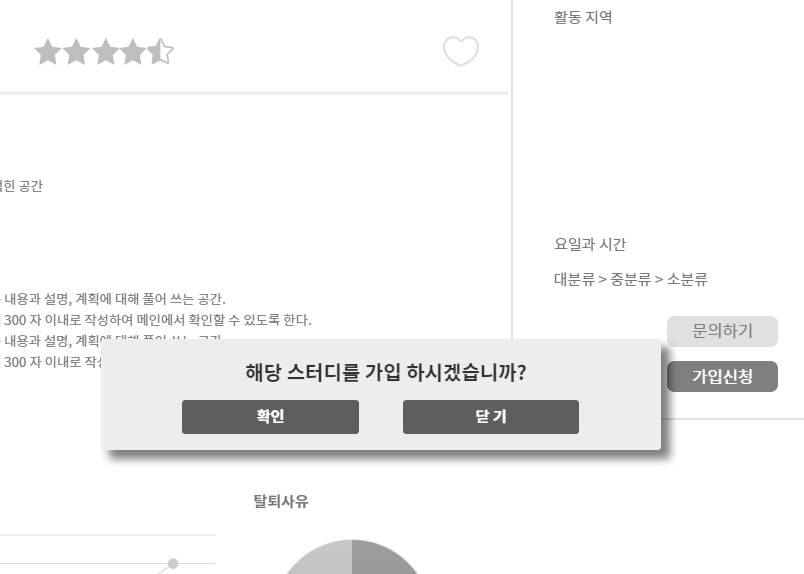

#UC - 스터디 가입(Study Join)
개설된 스터디에 대해 가입을 신청하는 유스케이스이다.

## 주 액터(Primary Actor)
회원

## 보조 액터(Secondary Actor)

## 사전 조건(Preconditions)
- 로그인을 한 상태이다.
- 스터디 상세 페이지를 출력하였다.

## 종료 조건(Postconditions)
- 스터디 가입 요청을 하였다.

## 시나리오(Flow of Events)

### 기본 흐름(Basic Flows)
- 1. 액터는 스터디 조회 후 원하는 스터디를 클릭한다.
- 2. 시스템은 스터디 상세 폼을 출력한다.
- 3. 액터는 해당 스터디를 확인 후 가입하기 버튼을 클릭한다.
- 4. 시스템은 가입 확인 문구를 출력한다.
- 5. 엑터는 확인 버튼을 클릭한다.
- 6. 시스템은 스터디 상세 폼을 출력한다.

### 대안 흐름(Alternative Flows)
- 4.1 액터는 취소 버튼을 클릭한다.
- 4.2 시스템은 가입 확인 문구창을 닫는다.

### 예외 흐름(Exception Flows)

### 스터디 가입
