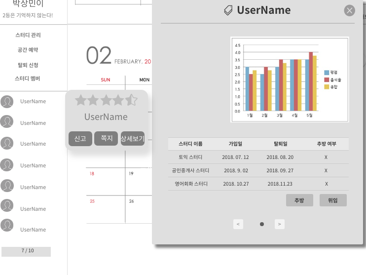

#UC - 스터디 멤버 관리(StudyMemberDetailView)
- 스터디에 가입한 멤버들을 관리할 수 있는 유스케이스 이다.

## 주 액터(Primary Actor)
스터디 장

## 보조 액터(Secondary Actor)

## 사전 조건(Preconditions)
1. 액터는 마이페이지를 클릭한다.
2. 시스템은 마이페이지 폼을 출력한다.
3. 액터는 해당 스터디를 클릭한다.
4. 시스템은 해당 스터디 폼을 출력한다.

## 종료 조건(Postconditions)
- 멤버를 조회 하였다.
- 멤버를 신고 하였다.
- 멤버에게 쪽지를 보냈다.
- 멤버에게 스터디장 권한을 위임 하였다.
- 멤버를 추방 하였다.

## 시나리오(Flow of Events)

### 멤버 조회하기 (스터디 원도 가능)
1. 액터는 좌측을 보면 해당 스터디의 멤버를 확인 할 수 있다.
2. 액터는 원하는 스터디 멤버에 마우스를 올린다.
3. 시스템은 해당 스터디 멤버의 평점과 닉네임 등 간략한 정보를 출력한다. 

### 멤버 상세조회 (스터디 원도 가능)
1. 액터는 "멤버 조회하기 3. " 에서 상세보기 버튼을 클릭한다. 
2. 시스템은 해당 스터디 원의 정보를 상세히 출력한다.

### 멤버에게 쪽지 보내기 (스터디 원도 가능)
1. 멤버 상세 조회 폼에서 쪽지 보내기 버튼을 클릭 한다.
2. 시스템은 쪽지 보내기 폼을 출력한다.
3. 액터는 보내고자 하는 내용을 작성 후 완료 버튼을 클릭한다.
4. 위의 작업을 완료 후 해당 스터디의 폼이 출력된다.

### 멤버 신고하기 (스터디 원도 가능)
1. 액터는 "멤버 조회하기 2. " 에서 신고 버튼을 클릭한다.
2. 시스템은 신고하기 폼을 출력한다.
3. 액터는 신고하고자 하는 내용을 작성 후 완료 버튼을 클릭한다.
4. 위의 작업을 완료 후 해당 스터디의 폼이 출력된다. 

### 스터디장 권한 위임하기
1. 액터는 멤버 상세 조회 폼에서 스터디 위임 버튼을 클릭 한다.
2. 시스템은 위임 확인 폼을 출력한다.
3. 액터는 확인을 누른다.
4. 시스템은 해당 멤버에게 스터디 장의 권한 위임하였다.

### 멤버 추방 하기
1. 액터는 멤버 상세 조회 폼에서 추방 버튼을 클릭 한다.
2. 시스템은 추방 확인 폼을 출력한다.
3. 액터는 확인을 누른다.
4. 시스템은 해당 회원의 추방 횟수를 1 증가시키고, 탈퇴추방완료 컬럼에 추방을 
저장 , 스터디 완료일에 추방 일자를 기입한다. 이후 스터디 메인 폼으로 돌아간다.
    - 추방 취소의 경우 바로 스터디 메인 폼으로 돌아간다.

### 스터디 멤버 조회
