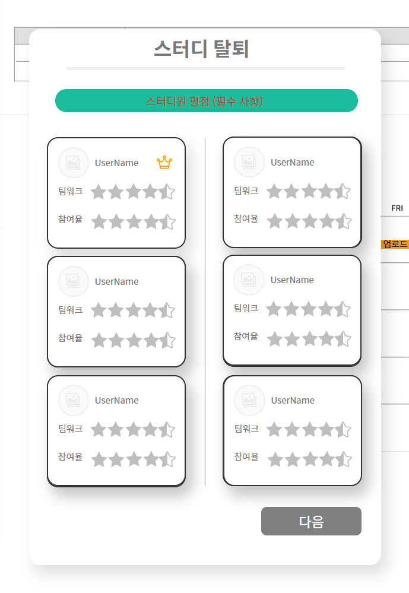
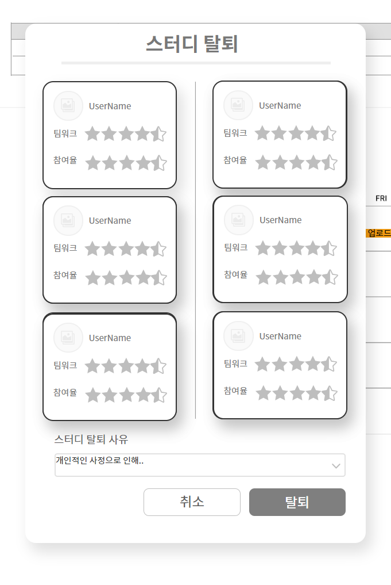
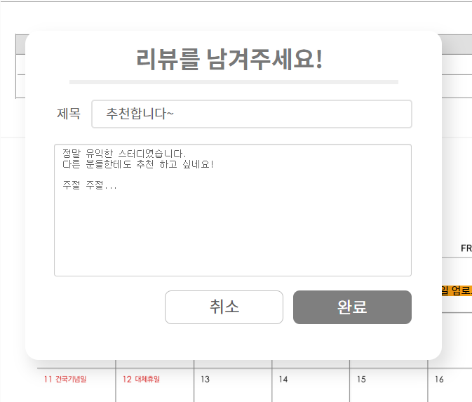

# UC - 스터디 그룹 탈퇴

스터디원이 스터디 그룹을 탈퇴 및 그룹 내 스터디원들을 평가하는 유스케이스이다.

## 주 액터(Primary Actor)

스터디원

## 보조 액터(Secondary Actor)

## 사전 조건(Preconditions)

- 스터디 그룹에 속해 있다.

## 종료 조건(Postconditions)

- 스터디원 평가 후 스터디 그룹을 탈퇴 한다.
- 스터디 그룹 탈퇴 후 리뷰를 남긴다.
- 스터디 그룹 탈퇴 후 리뷰를 남기지 않는다.

## 시나리오(Flow of Events)

### 스터디 그룹 탈퇴하기

1. 액터는 탈퇴하려는 스터디 그룹의 MyStudy 페이지에서 탈퇴 신청을 클릭한다.
2. 시스템은 스터디 탈퇴 신청 폼(스터디원 평가, 스터디 탈퇴 사유)을 팝업창으로 출력한다.
3. 액터는 탈퇴 사유를 선택하고 스터디원들을 평가한다.
4. 시스템은 비활성화 상태인 탈퇴 버튼을 활성화한다.
    - 스터디원들을 모두 평가하지 않았다면,
        - 시스템은 탈퇴 버튼을 활성화하지 않는다.
5. 액터는 활성화된 탈퇴 버튼을 누른다.
4. 시스템은 탈퇴 신청 데이터를 저장하고 해당 액터를 스터디 그룹에서 제외한다.
5. 시스템은 해당 그룹 내 스터디원들에게 탈퇴자 평가 유스케이스를 발생시킨다.
6. 시스템은 스터디 그룹 리뷰 남기기 폼(리뷰 내용)을 팝업창으로 출력한다.
7. 액터는 스터디 그룹 리뷰(내용은 최대 300자 이내)를 작성한다.
8. 시스템은 리뷰를 등록하고 MyPage로 돌아간다.
    - 리뷰를 작성하지 않았다면,
        - 시스템은 리뷰를 등록하지 않는다.

## UI 프로토타입

