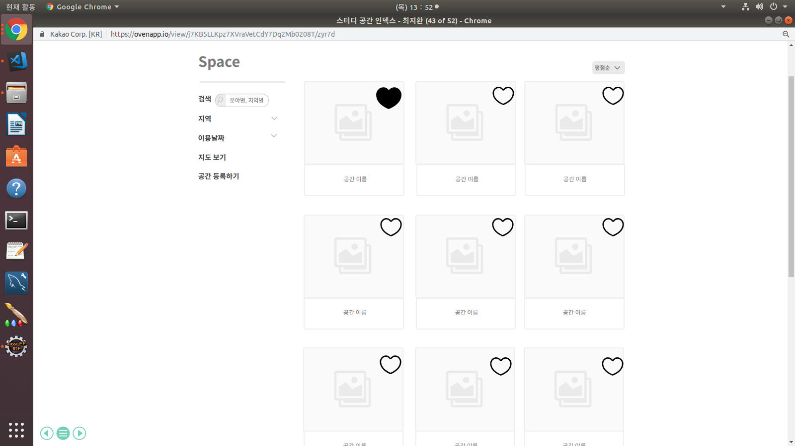

# UC001 - 스터디공간관리
액터 위치 주변의 스터디룸 목록을 조회 하는 것

## 주 액터(Primary Actor)

비회원, 회원

## 보조 액터(Secondary Actor)

## 사전 조건(Preconditions)

## 종료 조건(Postconditions)

- 스터디공간을 조회하였다.

## 시나리오(Flow of Events)

### 스터디공간 조회하기   

1. 액터는 메인페이지에서 공간 버튼을 클릭하거나 스터디 메뉴에서 스터디 공간을 누른다.
2. 시스템은 액터 위치의 지도와 해당 위치 주변에 있는 스터디룸 목록을 출력한다.
    - 스터디 메뉴에서 넘어왔다면 해당 스터디 위치에 기반한 목록을 출력한다.
    - 비회원의 경우 초기 지도 위치 설정은 디폴트(서울역)로 한다.
    - 해당 위치 주변에 스터디룸이 존재하지 않는다면,
        - 시스템은 주변에 스터디룸을 찾지 못하였다는 내용을 출력한다.
3. 액터는 목록에서 원하는 스터디룸을 선택해 클릭한다.
4. 시스템은 선택된 스터디룸에 대하여 상세 정보(가격, 사진, 설명, 편의물품, 연락처)를 출력한다.

## UI 프로토타입

### 스터디룸 조회 목록

 

