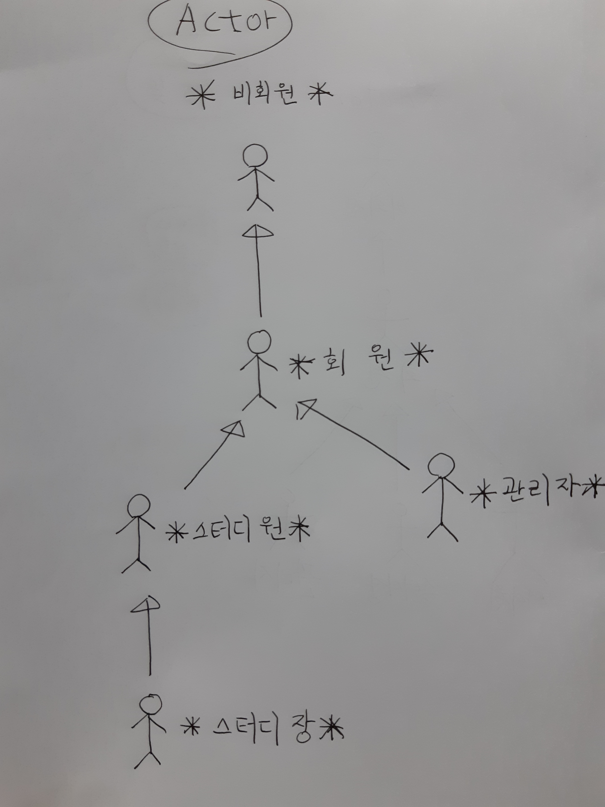
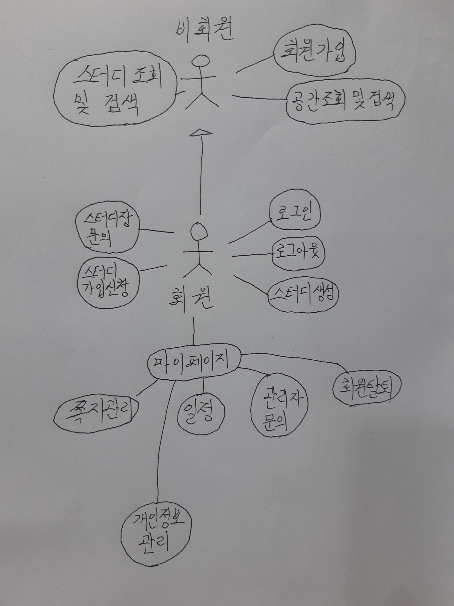
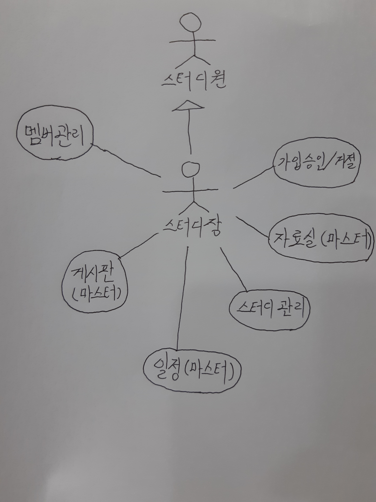

# 유스케이스

## Actors

### 비회원
- 시스템에 로그인 하지 않은 사용자

### 회원
- 시스템에 로그인 한 사용자

### 스터디원
- 스터디 그룹에 속한 회원

### 스터디장
- 스터디 그룹을 관리하는 회원

### 관리자
- 관리자에 등록된 로그인 사용자

## Use-Cases

### [회원가입](uc001-SignUp.md)(비회원)
- 비회원이 로그인을 위해 회원에 가입하는 것.

### [스터디 조회 및 검색](sangmin/uc-스터디조회.md)(비회원, 회원)
- 비회원 및 회원이 스터디 그룹을 조회, 검색 하는 것

### [스터디룸 조회](sangmin/uc-스터디룸조회.md)(비회원, 회원)
- 비회원 및 회원이 스터디 공간을 조회하는 것

### [로그인 하기](jihwan/uc-Login.md)(회원)
- 회원이 로그인을 하는 것

### [로그아웃 하기](jihwan/uc-Logout.md)(회원)
- 로그인된 회원이 로그아웃을 하는 것

### 회원탈퇴(회원)
- 회원이 서비스에서 탈퇴하는 것.

### [개인정보 관리](jihwan/uc-MyInformation.md)(회원)
- 회원이 개인 정보를 조회, 수정 하는 것

### 개인 일정 조회(회원)
- 회원이 개인 일정을 조회하는 것

### [스터디 문의](jihwan/uc-StudyAsk)(회원)
- 회원이 해당 스터디장에게 문의하는 것

### [스터디 가입 신청](jihwan/uc-StudyJoin.md) (회원)
- 회원이 스터디 그룹에 가입 신청하는 것

### [스터디 생성](sangmin/uc-스터디생성.md)(회원)
- 회원이 스터디 그룹을 생성하는 것

### 관리자에게 문의하기(회원)
- 회원이 관리자에게 문의하는 것

### 쪽지관리시스템(회원)
- 회원이 쪽지를 관리하는 것

### [자료실 관리 시스템](sangmin/uc-자료실관리시스템.md)(회원)

### [스터디 그룹 탈퇴자 평가](heewook/uc-탈퇴자평가.md)(스터디원)
- 스터디원이 자신이 속한 스터디 그룹을 탈퇴하는 회원을 평가하는 것

### 스터디 그룹 탈퇴 및 스터디원 평가하기(스터디원)
- 스터디원이 스터디 그룹을 탈퇴하면서 다른 스터디원들을 평가하는 것

### 스터디 게시판 관리(스터디장, 스터디원)
- 스터디원이 게시판의 글을 등록, 조회, 수정, 삭제 하는 것

### [스터디 그룹의 스터디원 정보 조회](jihwan/uc-StudyMemberManagement)(스터디원)
- 스터디원이 그룹의 다른 스터디원 정보를 조회, 신고, 쪽지송신하는 것

### 스터디 자료실 관리(스터디원, 스터디장)
- 스터디원이 스터디 자료실을 등록, 조회, 수정, 삭제하는 것

### [스터디 일정 관리](heewook/uc-스터디일정.md)(스터디원, 스터디장)
- 스터디원이 그룹의 일정을 등록, 조회, 수정, 삭제 하는 것

### 스터디공간 관리(스터디원, 스터디장)
- 스터디원이 스터디 공간을 조회, 예약, 예약취소 하는 것

### [스터디원 가입 승인/거절](sangmin/uc-가입승인_거절.md)(스터디장)
- 스터디장이 스터디 그룹에 가입 신청한 회원을 승인/거절 하는 것

### [스터디 그룹의 스터디원 관리](jihwan/uc-StudyMemberManagementCaptain)(스터디장)
- 스터디장이 그룹의 스터디원을 조회, 삭제 하는 것

### [스터디 그룹 관리](heewook/uc-스터디관리.md)(스터디장)
- 스터디장이 그룹을 조회, 수정, 삭제 하는 것

### 관리자 고객센터 관리(관리자)
- 관리자가 문의, 신고 메세지를 관리하는 것

### [관리자 회원 관리](jihwan/uc-MemberManagement.md)(관리자)
- 관리자가 회원들을 조회, 검색, 삭제하는 것

### [관리자 전체 스터디 그룹 관리](heewook/uc-관리자스터디관리.md)(관리자)
- 관리자가 전체 스터디 그룹을 조회, 검색, 삭제 하는 것

